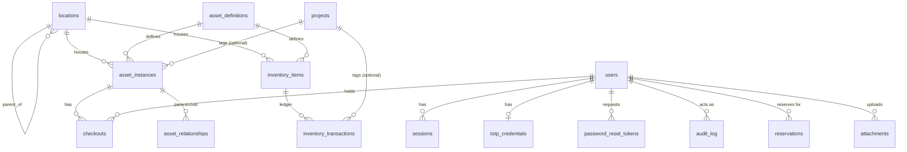

# NEST — Database Design

**Inputs:** NEST PRD v1.0, System Instructions, NEST ADR (approved), NEST Technical Design Specification (approved)
**Scope note:** This is the authoritative schema design — every table, type, constraint, index, and grant NEST's PostgreSQL database will have at MVP launch. It is expressed as reference DDL because DDL *is* the natural notation for a database design; it is not application code and is not meant to be run as-is against a live environment — it becomes the first Prisma migration during implementation, reviewed and adapted to Prisma's migration format at that time.

Target: PostgreSQL 16+. Required extensions: `pgcrypto` (UUID generation), `ltree` (location path containment queries), `pg_trgm` (optional, trigram support if fuzzy matching is added later — not enabled at MVP unless needed).

---

## 1. Conventions

| Convention | Rule |
|---|---|
| Primary keys | `uuid`, generated via `gen_random_uuid()`, except `audit_log` (`bigint identity` — cheap monotonic append) and `security_settings` (`integer`, fixed single row) |
| Timestamps | `timestamptz`, always UTC; `created_at` on every table; `updated_at` where rows are ever mutated (never on append-only tables) |
| Soft delete | `deleted_at timestamptz null` — present only on tables the PRD requires archive/recoverability for; absent everywhere else on purpose (its absence signals the table is append-only or has no delete concept) |
| Enums | Postgres native `ENUM` types, not free-text columns with app-level validation — invalid values are rejected by the database itself |
| Money / cost fields | Not present in MVP schema (no procurement-cost tracking in MVP scope); reserved as a Phase 2 addition to `inventory_transactions`/`asset_instances`, not created empty now |
| Foreign keys | `ON DELETE RESTRICT` by default (a referenced row cannot be hard-deleted while referenced); explicit `ON DELETE SET NULL` only where the PRD's model calls for it (e.g., `current_holder_user_id` when a user is later removed — though deactivation, not deletion, is the norm per §3.2) |
| Naming | `snake_case`, singular type names, plural table names |

---

## 2. Entity-Relationship Overview



`attachments`, `reservations`, and `movement_events` are polymorphic (`target_type` + `target_id` referencing either `asset_instances` or `inventory_items`) and are therefore not drawn with a single FK arrow above — see §4.14, §4.15, §4.16 for their integrity handling.

---

## 3. Enumerated Types

```sql
CREATE TYPE user_role AS ENUM (
  'viewer', 'contributor', 'stores_manager', 'admin'
);

CREATE TYPE location_type AS ENUM (
  'warehouse', 'room', 'cabinet', 'rack', 'shelf', 'bin', 'box', 'position', 'other'
);

CREATE TYPE asset_status AS ENUM (
  'registered', 'available', 'reserved', 'issued',
  'damaged', 'under_repair', 'lost', 'retired', 'disposed'
);

CREATE TYPE inventory_transaction_type AS ENUM (
  'receive', 'issue', 'consume', 'return',
  'adjust', 'transfer_out', 'transfer_in', 'reconciliation', 'dispose'
);

CREATE TYPE reservation_status AS ENUM (
  'active', 'fulfilled', 'cancelled', 'expired'
);

CREATE TYPE attachment_status AS ENUM (
  'pending_scan', 'available', 'quarantined', 'failed'
);

CREATE TYPE relationship_type AS ENUM (
  'contains', 'mounted_on', 'subsystem_of', 'spare_for'
);

CREATE TYPE polymorphic_target_type AS ENUM (
  'asset_instance', 'inventory_item'
);
```

---

## 4. Table Definitions

### 4.1 `users`

```sql
CREATE TABLE users (
  id                    uuid PRIMARY KEY DEFAULT gen_random_uuid(),
  email                 citext NOT NULL UNIQUE,
  password_hash         text NOT NULL,
  display_name          text NOT NULL,
  role                  user_role NOT NULL DEFAULT 'viewer',
  is_active             boolean NOT NULL DEFAULT true,
  totp_enabled          boolean NOT NULL DEFAULT false,
  failed_login_count    integer NOT NULL DEFAULT 0,
  locked_until          timestamptz,
  created_at            timestamptz NOT NULL DEFAULT now(),
  updated_at            timestamptz NOT NULL DEFAULT now(),
  deactivated_at        timestamptz
);

CREATE INDEX idx_users_role ON users (role) WHERE is_active;
```

`totp_required` is *not* a column (see TDS §12.4) — it is computed at request time from `role` + `security_settings.require_2fa_for_viewer`.

### 4.2 `sessions`

```sql
CREATE TABLE sessions (
  id                    uuid PRIMARY KEY,          -- SHA-256 hash of the client-side token, per TDS §12.1
  user_id               uuid NOT NULL REFERENCES users(id) ON DELETE CASCADE,
  created_at            timestamptz NOT NULL DEFAULT now(),
  last_seen_at          timestamptz NOT NULL DEFAULT now(),
  expires_at            timestamptz NOT NULL,
  revoked_at            timestamptz,
  step_up_verified_at   timestamptz,
  ip_address            inet NOT NULL,
  user_agent            text NOT NULL
);

CREATE INDEX idx_sessions_user_active ON sessions (user_id) WHERE revoked_at IS NULL;
CREATE INDEX idx_sessions_expiry ON sessions (expires_at) WHERE revoked_at IS NULL;
```

`ON DELETE CASCADE` on `user_id` is intentional here (unlike the general "no hard delete" rule) because users are deactivated, not deleted, in normal operation — cascade only fires in the rare admin hard-delete path, and existing sessions should not survive that regardless.

### 4.3 `totp_credentials`

```sql
CREATE TABLE totp_credentials (
  user_id               uuid PRIMARY KEY REFERENCES users(id) ON DELETE CASCADE,
  secret_encrypted      bytea NOT NULL,
  enrolled_at           timestamptz NOT NULL DEFAULT now(),
  recovery_codes        jsonb NOT NULL DEFAULT '[]'::jsonb
);
```

`recovery_codes` shape: `[{ "hash": "...", "used_at": null | "timestamptz" }, ...]` — validated at the application layer; ten entries seeded at enrollment.

### 4.4 `password_reset_tokens`

```sql
CREATE TABLE password_reset_tokens (
  id                    uuid PRIMARY KEY DEFAULT gen_random_uuid(),
  user_id               uuid NOT NULL REFERENCES users(id) ON DELETE CASCADE,
  token_hash            text NOT NULL,
  expires_at            timestamptz NOT NULL,
  used_at               timestamptz,
  created_at            timestamptz NOT NULL DEFAULT now()
);

CREATE INDEX idx_password_reset_user ON password_reset_tokens (user_id, used_at);
```

### 4.5 `permissions` / `role_permissions`

```sql
CREATE TABLE permissions (
  id                    uuid PRIMARY KEY DEFAULT gen_random_uuid(),
  key                   text NOT NULL UNIQUE,      -- e.g. 'asset.write'
  description           text NOT NULL
);

CREATE TABLE role_permissions (
  role                  user_role NOT NULL,
  permission_id         uuid NOT NULL REFERENCES permissions(id) ON DELETE CASCADE,
  PRIMARY KEY (role, permission_id)
);
```

Seeded via migration data (not runtime writes) with the capability matrix from TDS §5.1. Not read on the hot request path in MVP (the `RolesGuard` uses an in-code static table for speed); this exists purely as the durable seam for Phase 2, per PRD §7.3.

### 4.6 `locations`

```sql
CREATE TABLE locations (
  id                    uuid PRIMARY KEY DEFAULT gen_random_uuid(),
  name                  text NOT NULL,
  type                  location_type NOT NULL,
  parent_location_id    uuid REFERENCES locations(id) ON DELETE RESTRICT,
  description           text,
  is_active             boolean NOT NULL DEFAULT true,
  path_cache            ltree,                     -- maintained by service layer on write, see §6
  created_at            timestamptz NOT NULL DEFAULT now(),
  updated_at            timestamptz NOT NULL DEFAULT now()
);

CREATE INDEX idx_locations_parent ON locations (parent_location_id);
CREATE INDEX idx_locations_path_gist ON locations USING gist (path_cache);
```

Cycle prevention is enforced by a `BEFORE UPDATE` trigger (`prevent_location_cycle`, §6.1) rather than a declarative constraint, since Postgres cannot express "not an ancestor of itself" declaratively on a self-referencing tree.

### 4.7 `asset_definitions`

```sql
CREATE TABLE asset_definitions (
  id                    uuid PRIMARY KEY DEFAULT gen_random_uuid(),
  name                  text NOT NULL,
  category              text NOT NULL,
  manufacturer          text,
  part_number           text,
  datasheet_url         text,
  description           text,
  search_vector         tsvector GENERATED ALWAYS AS (
                           setweight(to_tsvector('english', coalesce(name, '')), 'A') ||
                           setweight(to_tsvector('english', coalesce(part_number, '')), 'A') ||
                           setweight(to_tsvector('english', coalesce(manufacturer, '')), 'B') ||
                           setweight(to_tsvector('english', coalesce(description, '')), 'C')
                         ) STORED,
  created_at            timestamptz NOT NULL DEFAULT now(),
  updated_at            timestamptz NOT NULL DEFAULT now(),
  deleted_at            timestamptz
);

CREATE INDEX idx_asset_definitions_search ON asset_definitions USING gin (search_vector);
CREATE INDEX idx_asset_definitions_category ON asset_definitions (category) WHERE deleted_at IS NULL;
CREATE INDEX idx_asset_definitions_part_number ON asset_definitions (part_number) WHERE deleted_at IS NULL;
```

### 4.8 `asset_instances`

```sql
CREATE TABLE asset_instances (
  id                        uuid PRIMARY KEY DEFAULT gen_random_uuid(),
  display_code              text NOT NULL UNIQUE,      -- e.g. 'AST-000482', generated at insert
  asset_definition_id       uuid NOT NULL REFERENCES asset_definitions(id) ON DELETE RESTRICT,
  serial_number             text UNIQUE,
  status                    asset_status NOT NULL DEFAULT 'registered',
  current_location_id       uuid NOT NULL REFERENCES locations(id) ON DELETE RESTRICT,
  current_holder_user_id    uuid REFERENCES users(id) ON DELETE SET NULL,
  project_id                uuid REFERENCES projects(id) ON DELETE SET NULL,
  condition_note            text,
  created_by                uuid NOT NULL REFERENCES users(id),
  updated_by                uuid NOT NULL REFERENCES users(id),
  created_at                timestamptz NOT NULL DEFAULT now(),
  updated_at                timestamptz NOT NULL DEFAULT now(),
  deleted_at                timestamptz,
  search_vector             tsvector GENERATED ALWAYS AS (
                               setweight(to_tsvector('english', coalesce(serial_number, '')), 'A') ||
                               setweight(to_tsvector('english', coalesce(display_code, '')), 'A') ||
                               setweight(to_tsvector('english', status::text), 'C')
                             ) STORED,
  CONSTRAINT chk_holder_only_when_issued
    CHECK (
      (status = 'issued' AND current_holder_user_id IS NOT NULL)
      OR (status <> 'issued')
    )
);

CREATE INDEX idx_asset_instances_status ON asset_instances (status) WHERE deleted_at IS NULL;
CREATE INDEX idx_asset_instances_location ON asset_instances (current_location_id) WHERE deleted_at IS NULL;
CREATE INDEX idx_asset_instances_holder ON asset_instances (current_holder_user_id) WHERE current_holder_user_id IS NOT NULL;
CREATE INDEX idx_asset_instances_definition ON asset_instances (asset_definition_id);
CREATE INDEX idx_asset_instances_search ON asset_instances USING gin (search_vector);
```

Note: `search_vector` here deliberately excludes the denormalized location path and holder name mentioned as illustrative in the TDS — those are joined at query time instead, since embedding mutable foreign display data into a generated column would require a trigger on every referenced table's update to stay correct. Location/holder search is served by joining `locations.name`/`path_cache` and `users.display_name` into the search predicate at query time (see §4.7 pattern extended to the query, not the column). This is a refinement of the TDS design made at this level of detail; it does not change the TDS's functional guarantee (search still covers holder and location), only how it's computed.

### 4.9 `inventory_items`

```sql
CREATE TABLE inventory_items (
  id                    uuid PRIMARY KEY DEFAULT gen_random_uuid(),
  asset_definition_id   uuid NOT NULL REFERENCES asset_definitions(id) ON DELETE RESTRICT,
  location_id           uuid NOT NULL REFERENCES locations(id) ON DELETE RESTRICT,
  unit                  text NOT NULL,
  quantity_on_hand      integer NOT NULL DEFAULT 0 CHECK (quantity_on_hand >= 0),
  reorder_threshold     integer,
  created_at            timestamptz NOT NULL DEFAULT now(),
  updated_at            timestamptz NOT NULL DEFAULT now(),
  deleted_at            timestamptz,
  UNIQUE (asset_definition_id, location_id)
);

CREATE INDEX idx_inventory_items_location ON inventory_items (location_id) WHERE deleted_at IS NULL;
CREATE INDEX idx_inventory_items_low_stock ON inventory_items (asset_definition_id)
  WHERE reorder_threshold IS NOT NULL AND deleted_at IS NULL;
```

`low_stock` remains unstored; queried as `quantity_on_hand <= reorder_threshold` (TDS §4.2).

### 4.10 `inventory_transactions`

```sql
CREATE TABLE inventory_transactions (
  id                    uuid PRIMARY KEY DEFAULT gen_random_uuid(),
  inventory_item_id     uuid NOT NULL REFERENCES inventory_items(id) ON DELETE RESTRICT,
  type                  inventory_transaction_type NOT NULL,
  quantity_delta        integer NOT NULL CHECK (quantity_delta <> 0),
  reason                text,
  related_location_id   uuid REFERENCES locations(id),
  project_id            uuid REFERENCES projects(id) ON DELETE SET NULL,
  actor_user_id         uuid NOT NULL REFERENCES users(id),
  created_at            timestamptz NOT NULL DEFAULT now(),
  CONSTRAINT chk_reason_required
    CHECK (
      type NOT IN ('adjust', 'reconciliation', 'dispose')
      OR (reason IS NOT NULL AND length(trim(reason)) > 0)
    )
);

CREATE INDEX idx_inventory_transactions_item ON inventory_transactions (inventory_item_id, created_at DESC);
CREATE INDEX idx_inventory_transactions_type ON inventory_transactions (type, created_at DESC);
```

No `updated_at`, no `deleted_at`, no `UPDATE`/`DELETE` grant for `nest_app` (§7) — this table is append-only by database enforcement, not just convention.

### 4.11 `checkouts`

```sql
CREATE TABLE checkouts (
  id                        uuid PRIMARY KEY DEFAULT gen_random_uuid(),
  asset_instance_id         uuid NOT NULL REFERENCES asset_instances(id) ON DELETE RESTRICT,
  held_by_user_id           uuid NOT NULL REFERENCES users(id),
  checked_out_by_user_id    uuid NOT NULL REFERENCES users(id),
  checked_out_at            timestamptz NOT NULL DEFAULT now(),
  checked_in_at             timestamptz,
  checked_in_by_user_id     uuid REFERENCES users(id),
  condition_at_checkin      text,
  expected_return_at        timestamptz
);

-- The race-safety guarantee (TDS §8.1): only one open checkout per asset, enforced by the database.
CREATE UNIQUE INDEX uq_checkouts_open_per_asset
  ON checkouts (asset_instance_id)
  WHERE checked_in_at IS NULL;

CREATE INDEX idx_checkouts_holder_open ON checkouts (held_by_user_id) WHERE checked_in_at IS NULL;
CREATE INDEX idx_checkouts_asset_history ON checkouts (asset_instance_id, checked_out_at DESC);
```

### 4.12 `movement_events`

```sql
CREATE TABLE movement_events (
  id                    uuid PRIMARY KEY DEFAULT gen_random_uuid(),
  target_type           polymorphic_target_type NOT NULL,
  target_id             uuid NOT NULL,
  from_location_id      uuid REFERENCES locations(id),
  to_location_id        uuid NOT NULL REFERENCES locations(id),
  moved_by_user_id      uuid NOT NULL REFERENCES users(id),
  moved_at              timestamptz NOT NULL DEFAULT now(),
  reason                text
);

CREATE INDEX idx_movement_events_target ON movement_events (target_type, target_id, moved_at DESC);
```

`target_id` cannot carry a declarative FK since it references one of two tables depending on `target_type`. Referential integrity for polymorphic targets is enforced at the service layer (the write path always resolves and validates the target row inside the same transaction before inserting the event) and is covered by an integration test per target type (see §8.1 of the Testing section referenced in the ADR). This is a deliberate, documented trade-off — see §7's note on polymorphic integrity.

### 4.13 `reservations`

```sql
CREATE TABLE reservations (
  id                        uuid PRIMARY KEY DEFAULT gen_random_uuid(),
  target_type               polymorphic_target_type NOT NULL,
  target_id                 uuid NOT NULL,
  reserved_for_user_id      uuid NOT NULL REFERENCES users(id),
  requested_by_user_id      uuid NOT NULL REFERENCES users(id),
  quantity                  integer CHECK (quantity IS NULL OR quantity > 0),
  status                    reservation_status NOT NULL DEFAULT 'active',
  expires_at                timestamptz,
  created_at                timestamptz NOT NULL DEFAULT now(),
  updated_at                timestamptz NOT NULL DEFAULT now(),
  CONSTRAINT chk_quantity_only_for_inventory_item
    CHECK (
      (target_type = 'inventory_item' AND quantity IS NOT NULL)
      OR (target_type = 'asset_instance' AND quantity IS NULL)
    )
);

CREATE INDEX idx_reservations_target_active ON reservations (target_type, target_id) WHERE status = 'active';
CREATE INDEX idx_reservations_expiry ON reservations (expires_at) WHERE status = 'active' AND expires_at IS NOT NULL;
```

### 4.14 `asset_relationships`

```sql
CREATE TABLE asset_relationships (
  id                    uuid PRIMARY KEY DEFAULT gen_random_uuid(),
  parent_asset_id       uuid NOT NULL REFERENCES asset_instances(id) ON DELETE RESTRICT,
  child_asset_id        uuid NOT NULL REFERENCES asset_instances(id) ON DELETE RESTRICT,
  relationship_type     relationship_type NOT NULL,
  created_by             uuid NOT NULL REFERENCES users(id),
  created_at             timestamptz NOT NULL DEFAULT now(),
  CONSTRAINT chk_no_self_relationship CHECK (parent_asset_id <> child_asset_id),
  UNIQUE (parent_asset_id, child_asset_id, relationship_type)
);

CREATE INDEX idx_relationships_parent ON asset_relationships (parent_asset_id);
CREATE INDEX idx_relationships_child ON asset_relationships (child_asset_id);
```

DAG-validity (no cycles across arbitrary depth) is a service-layer check at write time (graph reachability query from `child_asset_id` back to `parent_asset_id` before insert), not a database constraint — Postgres cannot express arbitrary-depth acyclicity declaratively.

### 4.15 `attachments`

```sql
CREATE TABLE attachments (
  id                    uuid PRIMARY KEY DEFAULT gen_random_uuid(),
  target_type           polymorphic_target_type NOT NULL,
  target_id             uuid NOT NULL,
  storage_key           text NOT NULL UNIQUE,
  original_filename     text NOT NULL,
  declared_mime_type    text NOT NULL,
  detected_mime_type    text,
  size_bytes            bigint NOT NULL CHECK (size_bytes > 0),
  status                attachment_status NOT NULL DEFAULT 'pending_scan',
  uploaded_by_user_id   uuid NOT NULL REFERENCES users(id),
  uploaded_at           timestamptz NOT NULL DEFAULT now(),
  deleted_at            timestamptz
);

CREATE INDEX idx_attachments_target ON attachments (target_type, target_id) WHERE deleted_at IS NULL;
CREATE INDEX idx_attachments_status_pending ON attachments (status) WHERE status IN ('pending_scan');
```

### 4.16 `projects`

```sql
CREATE TABLE projects (
  id                    uuid PRIMARY KEY DEFAULT gen_random_uuid(),
  name                  text NOT NULL UNIQUE,
  is_active             boolean NOT NULL DEFAULT true,
  created_at            timestamptz NOT NULL DEFAULT now()
);
```

### 4.17 `audit_log`

```sql
CREATE TABLE audit_log (
  id                    bigint GENERATED ALWAYS AS IDENTITY PRIMARY KEY,
  actor_user_id         uuid REFERENCES users(id),
  action                text NOT NULL,
  target_type           text NOT NULL,
  target_id             uuid,
  before_state          jsonb,
  after_state            jsonb,
  session_id            uuid,
  ip_address            inet,
  user_agent            text,
  created_at            timestamptz NOT NULL DEFAULT now()
);

CREATE INDEX idx_audit_actor_time ON audit_log (actor_user_id, created_at DESC);
CREATE INDEX idx_audit_target ON audit_log (target_type, target_id);
CREATE INDEX idx_audit_action_time ON audit_log (action, created_at DESC);
CREATE INDEX idx_audit_created_at ON audit_log (created_at);
```

No `updated_at`, no soft-delete column, no FK `ON DELETE CASCADE` from `users` (deliberately plain `REFERENCES users(id)` with no cascade action — an attempt to hard-delete a user who has audit history is expected to fail or require the audit rows to be reassigned to a "system"/tombstoned actor, per PRD §29's "preserve historical audit attribution when users leave"; the exact reassignment behavior is an implementation-time decision documented at the point the admin hard-delete-user path, if it ever exists, is built — MVP only supports deactivation, not user deletion, per §6.2 of the API Contract, so this path is not exercised at launch).

### 4.18 `security_settings`

```sql
CREATE TABLE security_settings (
  id                                integer PRIMARY KEY CHECK (id = 1),
  require_2fa_for_viewer            boolean NOT NULL DEFAULT false,
  session_idle_timeout_minutes      integer NOT NULL DEFAULT 45,
  session_absolute_lifetime_hours   integer NOT NULL DEFAULT 12,
  large_reconciliation_threshold    integer NOT NULL DEFAULT 100,
  updated_by                        uuid REFERENCES users(id),
  updated_at                        timestamptz NOT NULL DEFAULT now()
);

-- Exactly one row, seeded at migration time:
INSERT INTO security_settings (id) VALUES (1);
```

`large_reconciliation_threshold` default of 100 is a placeholder pending the team-specific decision flagged in the TDS §17 open items — not a considered product number.

---

## 5. Cross-Table Constraints Not Expressible as a Single-Table Check

| Rule | Enforcement point |
|---|---|
| No double-issue of a serialized asset | `uq_checkouts_open_per_asset` partial unique index (§4.11) — database-enforced |
| `asset_instances.status` transitions follow the defined state machine (TDS §4.1) | Service layer only — Postgres cannot express a transition table declaratively; covered by unit tests per transition |
| `asset_relationships` forms a DAG (no cycles) | Service layer, pre-insert reachability check (§4.14) |
| `locations` tree has no cycles | `BEFORE UPDATE` trigger `prevent_location_cycle` (§6.1) |
| `inventory_items.quantity_on_hand` equals `SUM(inventory_transactions.quantity_delta)` for that item | Maintained transactionally by the service layer under `SELECT ... FOR UPDATE` (TDS §8.2); independently verifiable via the reconciliation query in §6.2 |
| `movement_events.target_id` / `reservations.target_id` / `attachments.target_id` reference a real row of the stated `target_type` | Service layer, validated inside the same transaction as the insert |
| `audit_log` insert accompanies every state-changing operation in the *same* DB transaction | Service layer (`AuditService.record` called inside each domain operation's transaction, TDS §11.1) — not database-enforced, since Postgres cannot know which application operations are "state-changing" |

---

## 6. Triggers & Maintained Derived Data

### 6.1 Location Cycle Prevention (design-level pseudocode, not final SQL)

A `BEFORE UPDATE OF parent_location_id ON locations` trigger walks the ancestor chain of the *new* `parent_location_id` and raises an exception if it encounters the row being updated (i.e., the node would become its own ancestor). The same function recomputes and writes `path_cache` for the row and, in a single pass, for all of its existing descendants, since a re-parent operation changes every descendant's ancestor path. This is scoped to run only on the (rare) location re-parenting operation, not on every location write, to keep the common case (registering assets, adjusting quantity) untouched by tree-maintenance cost.

### 6.2 Quantity Reconciliation Check (operational query, not a trigger)

Run on demand (admin action) or on a scheduled interval as a monitoring check, never as a silent auto-corrector (TDS §8.2):

```sql
SELECT ii.id, ii.quantity_on_hand, coalesce(sum(it.quantity_delta), 0) AS ledger_sum
FROM inventory_items ii
LEFT JOIN inventory_transactions it ON it.inventory_item_id = ii.id
GROUP BY ii.id, ii.quantity_on_hand
HAVING ii.quantity_on_hand <> coalesce(sum(it.quantity_delta), 0);
```

Any row returned is a data-integrity alert, surfaced to admins — not silently fixed.

---

## 7. Database Roles & Grants

Two roles per environment, matching ADR-004:

```sql
-- Runtime application role: least privilege, no DDL.
CREATE ROLE nest_app LOGIN PASSWORD :'nest_app_password';

GRANT USAGE ON SCHEMA public TO nest_app;
GRANT SELECT, INSERT, UPDATE, DELETE ON ALL TABLES IN SCHEMA public TO nest_app;
GRANT USAGE, SELECT ON ALL SEQUENCES IN SCHEMA public TO nest_app;

-- Audit table is append-only for the app role: revoke UPDATE/DELETE explicitly.
REVOKE UPDATE, DELETE ON audit_log FROM nest_app;
-- (SELECT, INSERT remain granted from the blanket grant above.)

-- Inventory ledger is append-only for the app role in the same way.
REVOKE UPDATE, DELETE ON inventory_transactions FROM nest_app;

-- No DDL rights of any kind.
REVOKE CREATE ON SCHEMA public FROM nest_app;

-- Migration role: owns the schema, used only by CI/CD, never by the running application.
CREATE ROLE nest_migrator LOGIN PASSWORD :'nest_migrator_password';
GRANT ALL PRIVILEGES ON SCHEMA public TO nest_migrator;
ALTER DATABASE nest OWNER TO nest_migrator;
```

This directly implements System Instructions §18 ("the runtime application database role must not possess unnecessary DDL privileges") and PRD §17.1/§38 ("audit log entries cannot be modified or deleted through any application code path — verified by attempting via API with admin credentials, must fail"). The `REVOKE UPDATE, DELETE ON audit_log` / `inventory_transactions` statements are the specific, testable mechanism behind that acceptance criterion: a security test connects as `nest_app` and asserts both statements fail with a Postgres permission error, independent of whatever the application code does or doesn't check.

`nest_migrator` credentials exist only in CI/CD secret storage (ADR-010); they are never present in the running backend's environment configuration.

---

## 8. Known Design Trade-offs (Documented, Not Deferred by Accident)

| Trade-off | Reasoning | Revisit condition |
|---|---|---|
| Polymorphic `target_type`/`target_id` (no DB-level FK) on `movement_events`, `reservations`, `attachments` | A single FK per row can't reference two different possible parent tables in standard Postgres without either a union view or per-type nullable FK columns, both of which the System Instructions caution against as unnecessary complexity for two target types | If a third target type is ever added (unlikely at MVP+Phase 2 scope) and integrity bugs actually surface in practice, revisit with a `CHECK` against a lookup pattern or per-type tables |
| `quantity_on_hand` stored (not purely computed) | Avoids `SUM()` over a growing ledger on every inventory read; correctness is protected by transactional discipline (§5) and the reconciliation check (§6.2), not by trusting the column blindly | If reconciliation checks ever reveal drift in practice, investigate the specific write path before considering a schema change |
| `path_cache` maintained by trigger, not computed on read | Subtree queries are on the hot path (every search with a location filter); recomputing ancestor paths per query at 50k+ rows would not meet the <500ms target | None expected pre-launch; revisit only if `ltree` proves operationally troublesome, in which case an application-maintained integer-array ancestor path is the fallback already noted in the TDS |

---

*End of document.*
